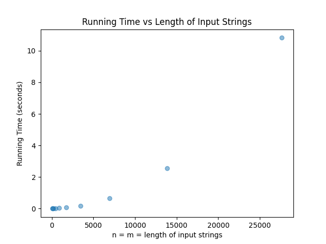

# Programming Assignment 3 - Highest Value Longest Common Sequence

**Isaac Wachsman (UFID: 28099694)**


## Project Structure Overview

- **src/main.cpp**: main driver
- **src/parser.cpp**: parses the input file to obtain the mapping from characters to values and the input strings
- **src/parser.h**: header file for parser
- **src/driver.cpp**: computes the highest value common subsequence of the two strings given
- **src/driver.h**: header file for driver
  
- **tests/inputN.txt**: the Nth input file
- **tests/outputN.txt**: the Nth output file

- **data/scatter_plot.png**: scatter plot of algorithm run time vs input string length

## Compilation and Execution Instructions
(Please note that the commands given are for Windows Powershell. Similar commands can be run for other terminals.)

1. Navigate to a folder of your choice on your terminal and run `git clone https://github.com/isaac-wachsman/Programming-Assignment-3-Highest-Value-Longest-Common-Sequence.git` to clone the repository to the folder.

2. Run `cd Programming-Assignment-3-Highest-Value-Longest-Common-Sequence` , then `cd src` to navigate to the src directory.

3. Run `g++ -o main main.cpp parser.cpp driver.cpp` to compile the matching program.

4. Run `./main ../tests/inputN.txt` where N = 1, 2, or 3 to run the algorithm on the provided input files. `../tests/inputN.txt` may be replaced with the path (relative to src) to any valid input text file.


## Input / Output

The input is expected to be in the form:

```
K
x1 v1
x2 v2
...
xK vK
A
B
```
The first line contains a single positive integer, K. The next K lines contains a character xi and a nonnegative integer value vi. The xi are expected to be distinct though two different characters may have the same value. The next line contains A, a string of arbitrary length, which uses only characters from the set {x1, ..., xK}. The last line contains B, a string of arbitary length, which uses only characters from the set {x1, ..., xK}.

**NOTE:** Input files that do not match this specified format will result in undefined behavior.


The output is printed in the terminal in the form:
```
max
C
```
The first line contains the maximum value of a common subsequence of the input strings A and B. The next line contains C, a string representing a common subsequence achieving the value max. Note that there may exist multiple common subsequences achieving a value of max.

## Question 1



## Question 2

## Question 3
